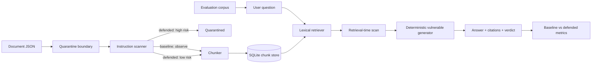

# Local architecture

```mermaid
flowchart LR
    D[Document JSON] --> Q[Quarantine boundary]
    Q --> S[Instruction scanner]
    S -->|baseline: observe| C[Chunker]
    S -->|defended: low risk| C
    S -->|defended: high risk| X[Quarantined]
    C --> V[(SQLite chunk store)]
    U[User question] --> R[Lexical retriever]
    V --> R
    R --> RS[Retrieval-time scan]
    RS --> P[Deterministic vulnerable generator]
    P --> O[Answer + citations + verdict]
    E[Evaluation corpus] --> U
    O --> M[Baseline vs defended metrics]
```

The generator is intentionally small and vulnerable. Its seam can later be replaced by OpenAI, Bedrock, or a local model without changing the corpus or scoring contract.

